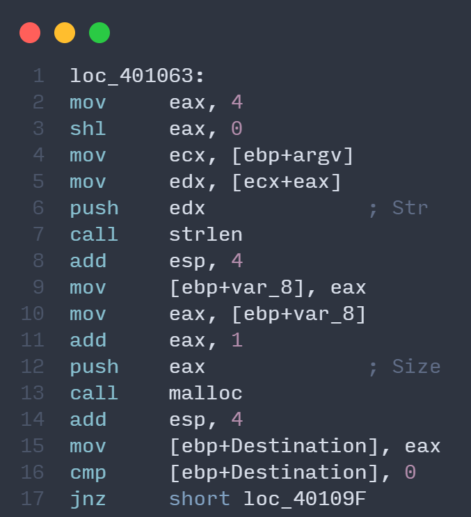

## Write Up for Julia Challenge from begin.re workshop

### **SectionOne**
- Opening the exe in ida pro we can find the main function with the following code at the start

<image src="./codesnaps/main.png" height=400> 

- we can see there are two local variables `var_8` and `Destination` and parameters like argc and argv.
- After the function prologue the first instruction is `cmp [ebp+argc], 2` where `argc` is the offset to the address of `argc` of main function hence `[ebp+argc]` contains the address of argc so this instruction checks if the value at `argc` is `2` i.e the number of command line arguments is `2`.
- The instruction `jz short loc_401063` is a branch instruction that exits if previous instruction does not result in the `zero flag (ZF)` being set or else goes to the address `401063`.

Going down on the call graph to next section.

### **SectionTwo**

- `mov eax, 4` This sets `eax` register to 4.*(The instruction `shl eax, 0` can be ignored as it does not alter eax)*
- `mov ecx, [ebp+argv]` pushes the address of `argv[]` array to `ecx`.

